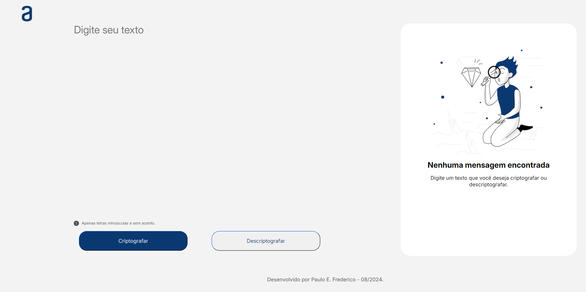
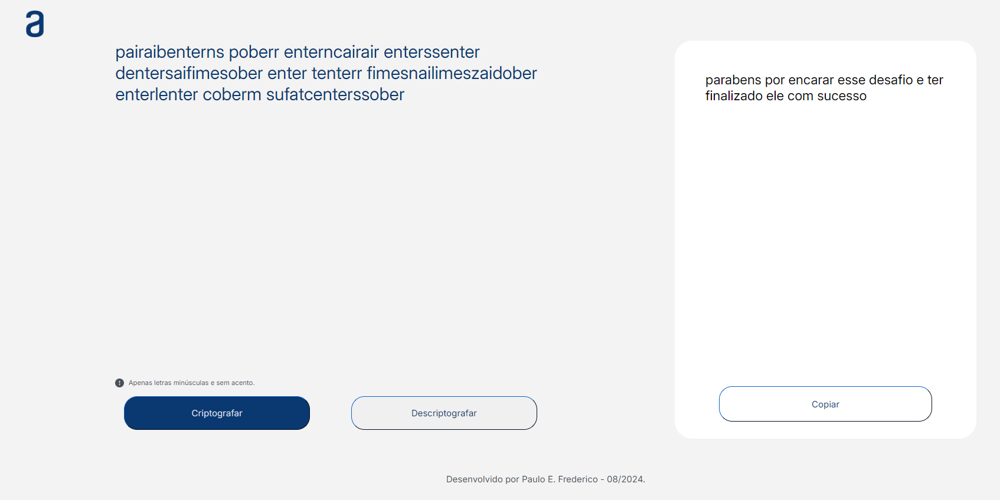

# Projeto: Codificador e Decodificador de Texto

Este projeto foi desenvolvido como parte do desafio "Praticando lógica de programação: Challenge Decodificador de Texto" proposto pela Oracle Next Education (ONE) em parceria com a Alura. O desafio tinha como objetivo aplicar os conceitos de lógica de programação aprendidos ao longo do curso.

## Funcionalidades

- **Criptografia de texto**: Substitui as vogais por combinações de letras.
- **Descriptografia de texto**: Reverte as combinações de letras para suas vogais originais.
- **Cópia do texto criptografado ou descriptografado**: Facilita o compartilhamento do resultado.

## Regras de Criptografia e Descriptografia

As seguintes regras são aplicadas para criptografar o texto:

- `a` é convertido para `ai`
- `e` é convertido para `enter`
- `i` é convertido para `imes`
- `o` é convertido para `ober`
- `u` é convertido para `ufat`

**Importante**:
- O texto deve ser inserido apenas em letras minúsculas.
- Não são permitidos acentos ou caracteres especiais.

## Tecnologias Utilizadas

- **HTML5**: Para a estruturação da página.
- **CSS3**: Para o estilo e layout.
- **JavaScript**: Para a lógica de criptografia e descriptografia.

## Screenshots

### Tela Inicial

*Descrição*: Tela inicial do projeto onde o usuário pode inserir o texto para criptografia ou descriptografia.

### Tela com Texto Criptografado

*Descrição*: Exemplo de um texto após ser criptografado usando as regras estabelecidas.

## Como Usar

1. Insira o texto que deseja criptografar ou descriptografar no campo apropriado.
2. Clique no botão "Criptografar" ou "Descriptografar" conforme necessário.
3. Use o botão "Copiar" para copiar o texto resultante.

## Autor

Desenvolvido por **Paulo E. Frederico**.

## Licença

Este projeto é licenciado sob a licença MIT - veja o arquivo [LICENSE](LICENSE) para mais detalhes.
